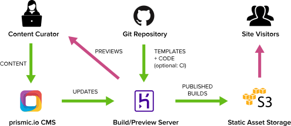

# Metalsmith Prismic template

An opinionated, bare bones template for static site generation from [prismic.io](https://prismic.io/) using [metalsmith](https://metalsmith.io/) and deploying to Amazon S3.

## This template includes

* Documentation on how to use this template and best practices
* [Handlebars](http://handlebarsjs.com/) templates
* [Sass](http://sass-lang.com/) styling
* Dependency on [metalsmith-prismic-server](https://github.com/futurice/metalsmith-prismic-server) for automatically building and deploying changes from Prismic.io
  * Provides a webhook that Prismic.io can trigger to build and deploy on CMS content changes
  * Provides a server endpoint to preview unpublished content in Prismic.io
  * Provides a live reloading development mode that fetches Prismic.io content
* [Deployment to AWS S3](https://github.com/mwishek/metalsmith-s3)
* [Prismic.io example content](https://metalsmith-prismic-template.prismic.io/)
  * [Example content in API browser](https://metalsmith-prismic-template.prismic.io/api/)
  * [Generated example site deployed to S3](http://metalsmith-prismic-template.futurice.com/)
  * [Published content also running in Heroku](https://metalsmith-prismic.herokuapp.com/builds/preview/master/)

## How to use this template

* Install [Node.js](https://nodejs.org/en/download/).
* [Fork](https://help.github.com/articles/fork-a-repo/) or [duplicate](https://help.github.com/articles/duplicating-a-repository/) this template repository.
* Run `npm install`
* Copy `.env.tmpl` and rename to `.env` (this will be ignored by git)
* Optional: Run `npm run dev` to test this template with example data
* Set up a Prismic.io
  * Create a repository
  * Setup API & Security in Prismic.io settings
    * Create a new app at **Settings** > **API & Security** > **Create a new Application**. No need to provide a callback URL.
    * Put the generated master access token in `.env`
      `PRISMIC_TOKEN={PRISMIC_API_ACCESS_TOKEN}`
  * Setup preview in Prismic settings
    * Preview url: https://{HEROKU_APP_NAME}.herokuapp.com/preview
  * Setup webhooks in Prismic settings
    * URL: https://{HEROKU_APP_NAME}.herokuapp.com/build
    * Secret: {[Generate a random 'secret'](https://www.google.com/search?q=random+key+generator)}
  * Add tokens to `.env`
    * `PRISMIC_URL=https://{PRISMIC_APP_NAME}.prismic.io/api`
    * `PRISMIC_SECRET={PRISMIC_WEBHOOK_SECRET}`
  * Setup custom types in Prismic settings
    * See `docs/prismic-conventions` for best practices
    * See `prismic-custom-types/` for this example repositories custom type json files.
  * Create your own content
    * Go to the "Everything" tab and "Write something"
* Setup Amazon S3
  * Create an account
  * Create IAM tokens
  * Create S3 bucket
  * Add tokens to `.env`
    * `AWS_ACCESS_KEY_ID={AWS_ACCESS_KEY_ID}`
    * `AWS_SECRET_ACCESS_KEY={AWS_SECRET_ACCESS_KEY}`
    * `S3_BUCKET={S3_BUCKET_NAME}`
    * `S3_REGION={S3_END_POINT}`, e.g. 'eu-west-1'
* Setup a new heroku app
  * Set config variables
    * `AWS_ACCESS_KEY_ID`
    * `AWS_SECRET_ACCESS_KEY`
    * `PRISMIC_SECRET`
    * `PRISMIC_TOKEN`
    * `PRISMIC_URL`
  * Configure Github to [deploy to heroku](https://developer.github.com/guides/automating-deployments-to-integrators/).
    * Optionally put [Travis CI](https://docs.travis-ci.com/user/deployment/heroku/) in the middle if you aren't setting up separate staging and production environments and want some extra confidence that things build correctly.
* Adjust the template to your needs (sections that need to be adjusted are marked with \*TEMPLATE\*)
  * Adjust the metalsmith plugins in `server.js`
  * Configure the metalsmith-prismic linkResolver in `server.js` that generates prismic links and paths of prismic collections
  * Adjust the `docs/prismic-conventions.md`
  * Adjust the `src/`, `/layouts` and `partials/` directories' to match your content to Prismic
* Run `npm run dev`. The development mode has live reloading but needs to be restarted manually if content in Prismic.io changes.

### Directory structure

* `builds/`: Output directory for built sites
* `layouts/`: Page layouts
* `partials/`: Embeddable page elements
* `plugins/`: Custom metalsmith plugins
* `prismic-custom-types/`: Backups of Prismic custom types
* `src/`: Source files which will be transformed to output
* `utils/`: Utility functions
* `server.js`: Server and build logic with metalsmith-plugins

